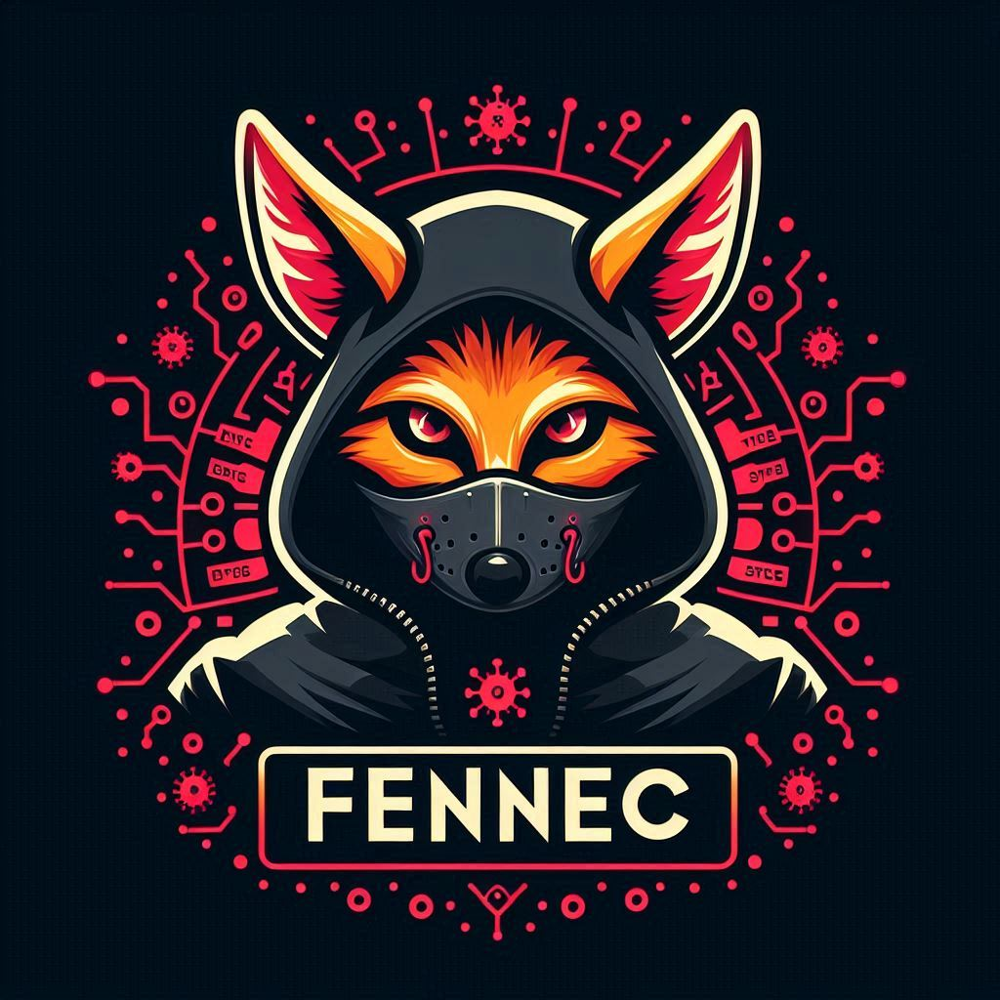

# Fennec

## Fennec Command and Control (C2) framework with three components: a victim agent, a server, and a control app. The victim connects to the server, and the control app manages the victim through the server.

## Requirements

### `JDK 21:` Required for running the server and control app.

### `Gradle 8.5:` Required for building and managing the Java server and control app.
